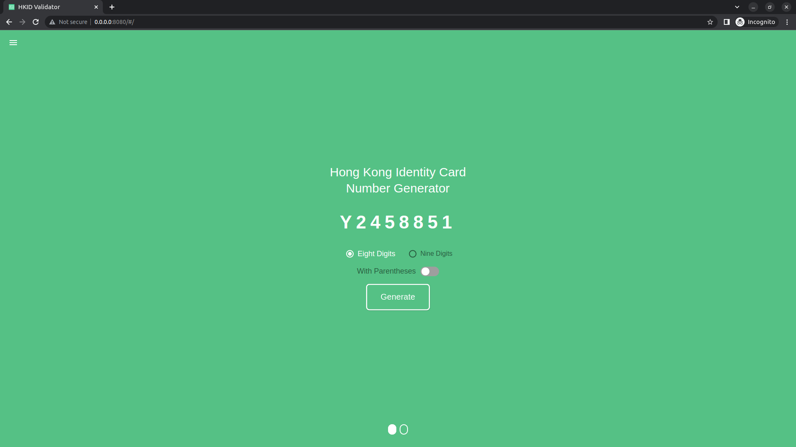
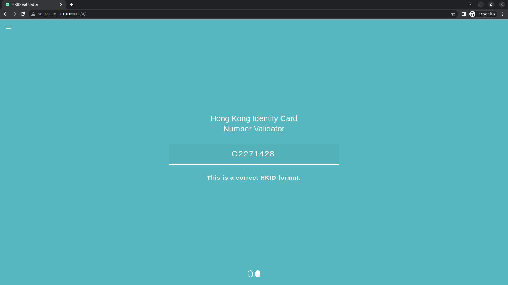

# HKID Validator Library
[](https://github.com/wchklaus/hkid_validator/actions/workflows/docker-ci.yml)
[](https://github.com/wchklaus/hkid_validator/actions/workflows/fork-ci.yml)
[](https://github.com/wchklaus/hkid_validator/actions/workflows/github-page-ci.yml)
[](https://github.com/wchklaus/hkid_validator/actions/workflows/github-page-cicd.yml)
[](https://github.com/wchklaus/hkid_validator/actions/workflows/pages/pages-build-deployment)

HKID Validator Library, support HKID Validation and generated eight or nine digits validated HKID.

<p align="center">
     <a href="https://github.com/flutter/flutter/tree/3.3" alt="Flutter">
        </a>
     <a alt="Dart">
        </a>
     <a alt="DevTools">
        </a>
     <a alt="VS Code">
        </a>
     <a alt="VS Code">
        </a>
</p>

|             | Android | iOS  | Linux | macOS  | Web | Windows     |
|-------------|---------|------|-------|--------|-----|-------------|
| **Support** | Any | Any | Any   | Any | Any | Any         |

## Usage
To use this plugin, add `hkid_validator` as a [dependency in your pubspec.yaml file].

### Examples
Here are small examples that show you how to use the HKIDValidator.

#### Validate the HKID 
```dart
// Obtain HKIDValidator.
final hkidValidator = HKIDValidator();

// Check is HKID Validate or not; HKID - U443902 wuth Specific Character 0
bool isIdValid = HKIDValidator().isHKIDValid('U443902', '0');
```

####  Generate HKID 
```dart
// Generate the Random Validate HKID with Eight or Nine digits
String hkid = HKIDValidator().genRanValidHKID(isEight: true);

// Generate the Validate HKID with eight number
String hkid = HKIDValidator().genValidHKID(isEight: true);

// Generate the Validate HKID with Nine number
String hkid = HKIDValidator().genValidHKID(isEight: false);```
```

####  Add Parentheses at the last character
```dart
String hkid = hkid.withPARES();
```

### Testing
Please reference from the test folder, there are two test.
- [Generate Random Validate HKID Test](https://github.com/wchklaus/hkid_validator/test/gen_random_validate_hkid_test.dart)
- [HKID Validator Test](https://github.com/wchklaus/hkid_validator/test/hkid_validator_test.dart)

# [HKID Validator Demo](example)
The UI of HKID Validator Web App, was inspired by [icelam](https://github.com/icelam/hkid-generator).
A Flutter Web Demo for HKID Validator, this web demo is used to demonstrate the powerful of Flutter in Web Development and the usage of the packages called hkid_validator.
| | |
|:-------------------------:|:-------------------------:|
| | 
| | 
| | 
| | 

# Validator & Generator Test Demo
### HKID Validator Test

### Genearte HKID Validate Test

