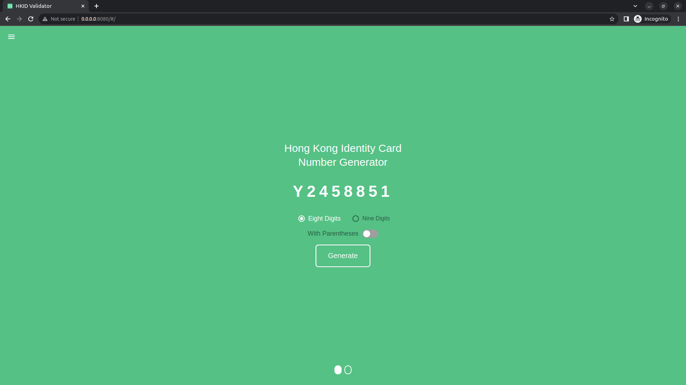
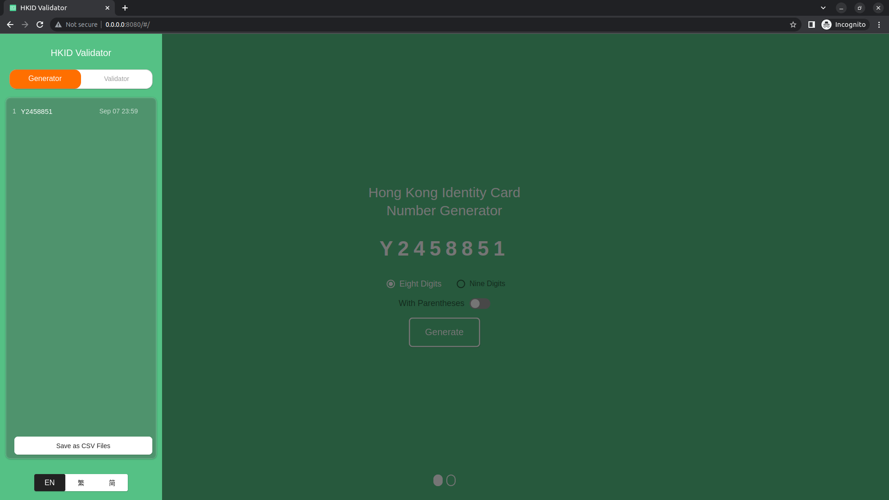
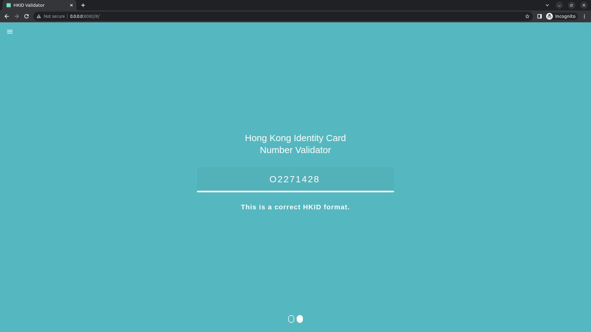
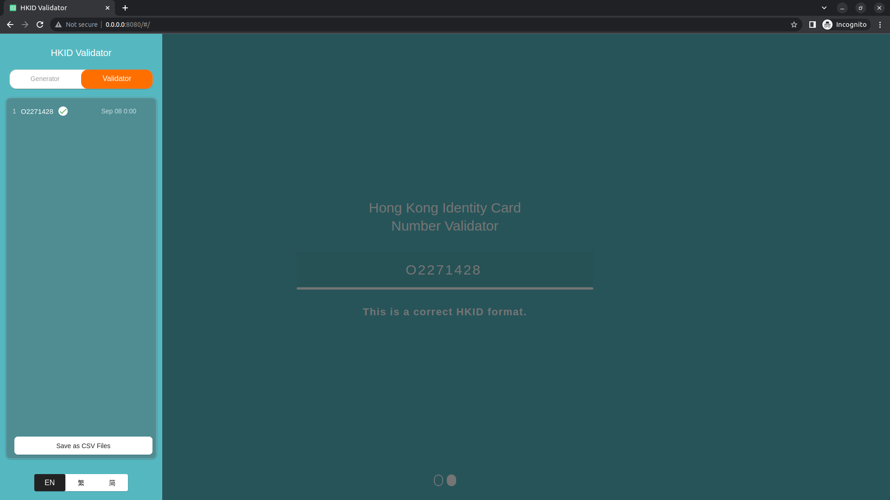

# HKID Validator - Flutter Web Demo

The UI of HKID Validator Web App, was inspired by [icelam](https://github.com/icelam/hkid-generator).
A Flutter Web Demo for HKID Validator, this web demo is used to demonstrate the powerful of Flutter in Web Development and the usage of the packages called [hkid_validator](../lib/hkid_validator.dart). 

     
     
     
     

### Used third party libraries as below:

     
     
          
          
     <a href="https://pub.dev/packages/sembast" alt="intl">
        =3.1.1 <5.0.0 -4BC51D.svg?style=flat" /></a>     
     <a href="https://pub.dev/packages/idb_shim" alt="idb_shim">
        =2.0.1 <4.0.0 -4BC51D.svg?style=flat" /></a>

## Design Pattern
- Creational - Singleton and Factory

## Statue Management Approach
- StatefulWidget
- StatefulWidget with ValueNotifier
- StatelessWidget

## Storage Methodology
Local Storage and IndexedDB are used on this project. Local storage used to store the locale of the web and status of web; IndexedDB used to store the Generated HKID and Validated HKID.
Storage:
- Local Storage
  - sysConfig
  - secureStorage
  - container
- IndexedDB
  - GeneratedID
  - ValidatedID

## Localhost Running
$ flutter run --web-renderer html --no-sound-null-safety --dart-define=ENV=DEV -dart-define=FLUTTER_WEB_USE_SKIA=true -d chrome --release

# HKID Validator Demo
| | |
|:-------------------------:|:-------------------------:|
| | 
| | 
| | 
| | 
